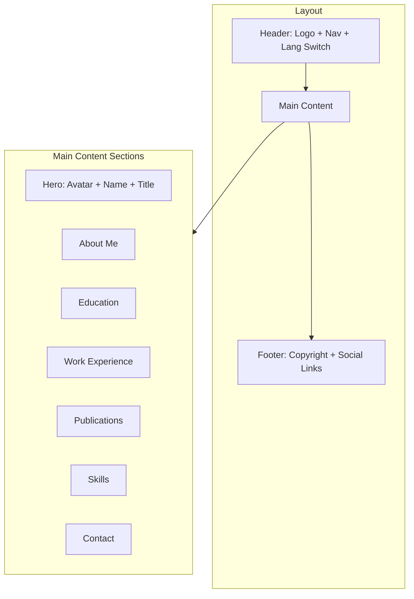

# 个人主页构建计划

## 项目概述

为 yuanluzhan.github.io 构建一个简约学术风格的个人主页，支持中英文双语切换，使用 Jekyll 静态网站生成器。

## 个人信息摘要（已确认）

- **姓名**: 袁路展 (Yuan Luzhan)
- **邮箱**: yuanluzhan@gmail.com
- **教育背景**:
  - 2021.09 – 2025.06: 北京邮电大学（硕士）
  - 2017.09 – 2021.06: 北京邮电大学（本科）
- **工作经历**: 2025.06 – 至今（京东，算法研究）
- **研究方向**: Generative Modeling, Model-based RL, Uncertainty Quantification, GRPO, Ensemble Learning
- **发表论文**:
  - TUGB (KDD 2026)
  - OPRADI (AAAI 2023, CCF-A) - 获 Deployed Application Award
  - CogSci 2024 (CCF-B)
- **技能**: Python, PyTorch, TensorFlow, XGBoost, Spark, SQL, Git
- **英语**: TOEFL 95
- **社交链接**:
  - GitHub: https://github.com/yuanluzhan
  - 知乎: https://www.zhihu.com/people/wu-se-wu-wei-zhi-tu
  - 邮箱: yuanluzhan@gmail.com
- **头像**: 已提供（蓝底证件照）

## 个人简介

**中文版**：
> 我是袁路展，北京邮电大学硕士，目前在京东从事算法研究工作。研究方向包括生成式建模、基于模型的强化学习、不确定性量化等。曾在 AAAI、KDD、CogSci 等顶级会议发表论文，并获得 AAAI 2023 Deployed Application Award。

**英文版**：
> I'm Yuan Luzhan, a Master's graduate from Beijing University of Posts and Telecommunications. Currently working as an algorithm researcher at JD.com. My research interests include Generative Modeling, Model-based RL, and Uncertainty Quantification. I have published papers at top venues including AAAI, KDD, and CogSci, and received the AAAI 2023 Deployed Application Award.

## 项目结构

```
yuanluzhan.github.io/
├── _config.yml              # Jekyll 配置文件
├── _data/
│   └── navigation.yml       # 导航菜单数据
├── _includes/
│   ├── header.html          # 页头组件
│   ├── footer.html          # 页脚组件
│   └── lang-switcher.html   # 语言切换组件
├── _layouts/
│   └── default.html         # 默认布局模板
├── _sass/
│   └── main.scss            # SCSS 样式源文件
├── assets/
│   ├── css/
│   │   └── style.scss       # 主样式入口
│   └── images/
│       └── avatar.jpg       # 头像图片（需用户提供）
├── en/
│   └── index.md             # 英文首页
├── zh/
│   └── index.md             # 中文首页
├── index.html               # 根页面（重定向到默认语言）
├── resume-zh_CN.pdf         # 中文简历（已有）
├── Gemfile                  # Ruby 依赖配置
└── README.md                # 项目说明
```

## 技术方案

### 多语言实现

采用目录结构方式实现多语言，无需额外插件（GitHub Pages 兼容性更好）：

- `/zh/` - 中文内容
- `/en/` - 英文内容
- 根目录 `index.html` 重定向到默认语言

### 页面模块

1. **Header**: 导航栏 + 语言切换
2. **Hero Section**: 头像 + 姓名 + 简介
3. **About**: 个人简介
4. **Education**: 教育背景
5. **Experience**: 工作经历
6. **Publications**: 论文发表
7. **Skills**: 技能展示
8. **Contact**: 联系方式
9. **Footer**: 版权信息 + 社交链接

### 设计风格

- **配色**: 深蓝 (#1a365d) + 白色 + 浅灰
- **字体**: 系统字体栈，中文使用思源黑体
- **布局**: 单栏居中，最大宽度 800px
- **特点**: 简洁、专业、易读

## 页面结构图



## 实施步骤

### 第一阶段：项目初始化
1. 创建 `Gemfile` 配置 Jekyll 依赖
2. 创建 `_config.yml` 配置站点信息
3. 创建目录结构

### 第二阶段：布局与样式
4. 创建 `_layouts/default.html` 基础布局
5. 创建 `_includes/` 组件（header, footer, lang-switcher）
6. 创建 `assets/css/style.scss` 样式文件

### 第三阶段：内容页面
7. 创建 `zh/index.md` 中文首页
8. 创建 `en/index.md` 英文首页
9. 创建根目录 `index.html` 重定向页

### 第四阶段：测试与部署
10. 本地运行 `bundle exec jekyll serve` 测试
11. 推送到 GitHub，自动部署到 GitHub Pages

## 关键配置

### _config.yml 示例

```yaml
title: Yuan Luzhan
description: AI Researcher
url: https://yuanluzhan.github.io
baseurl: ""

# 默认语言
lang: zh

# 构建设置
markdown: kramdown
plugins:
  - jekyll-seo-tag

# 排除文件
exclude:
  - Gemfile
  - Gemfile.lock
  - README.md
```

### Gemfile 示例

```ruby
source "https://rubygems.org"

gem "jekyll", "~> 4.3"
gem "jekyll-seo-tag"

# GitHub Pages 兼容
gem "github-pages", group: :jekyll_plugins
```

## 状态：✅ 信息收集完成，准备实施

## 后续扩展

- 添加博客功能（`_posts/` 目录）
- 添加项目展示页面
- 添加 Google Analytics 统计
- 添加评论系统（如 Giscus）
